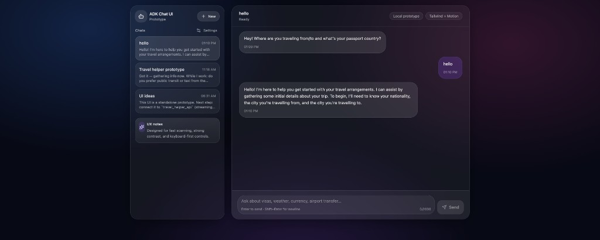

# Travel Helper Agent

## Introduction

Before you travel, you need to know some essential pre-departure information such as the entry rules for the country 
you're travelling to, the weather in the destination, the currency of the destination, top tourist spots and so on. 
Of course, you can search this information for every trip but that takes time and it's so old school! 

Instead, let's build a travel helper agent! This agent gathers the necessary information about the upcoming trip 
and provides essential pre-departure information you need for your trip.

> [!CAUTION]  
> Before you start, make sure to follow the [setup](../setup.md) page.

## Web chat UI (prototype)

You can talk to the same **Travel Helper** root agent from a modern browser UI (sidebar threads, streaming replies, dark theme) instead of only the ADK CLI or `adk web`.

**What it is**

- A **React + TypeScript** app (Vite) in the repo’s [`chatbot-ui`](../chatbot-ui) folder, styled with **Tailwind CSS** and **Framer Motion** for layout and message animations.
- The browser calls the **FastAPI** gateway in [`travel_helper_api`](../travel_helper_api) at `POST /v1/chat/stream`, which runs this package’s `root_agent` and streams model output as **Server-Sent Events (SSE)**.
- **Vite** proxies `/v1` and `/health` to the API in local development so you avoid CORS; see `chatbot-ui/vite.config.ts`.

**Run locally (summary)**

1. Start the API (from the repo root), e.g. `uvicorn travel_helper_api.main:app --reload --port 8011` (use the same port as the proxy in `chatbot-ui/vite.config.ts`).
2. In `chatbot-ui/`, run `npm install` and `npm run dev`, then open the URL Vite prints (e.g. `http://localhost:5173`).

**UX notes**

- High-contrast dark UI, keyboard-first input (Enter to send, Shift+Enter for a newline), and placeholders aligned with this agent (visas, weather, currency, airport transfer).
- “Local prototype” in the header indicates this stack is for development; production would add auth, error boundaries, and deployment configuration.

## Build sub-agents

Travel Helper Agent will rely on sub-agents to help. 

Go through [Travel Helper Agent - sub-agents](./sub_agents) to build the sub-agents first.

## Build root agent 

Once the sub-agents are built, it's time to combine them in a root agent.

Take a look at the [agent.py](agent.py) for details. 

## Run root agent

Once the root agent is built, go through [Travel Helper Agent - Run](./docs/run_agent.md) to test and run the root agent
locally.

## Deploy root agent

ADK has a few [deployment options](https://google.github.io/adk-docs/deploy/): Vertex AI Agent Engine, Cloud Run, or self-managed. 

Go through [Travel Helper Agent - Deploy Agent](./docs/deploy_agent.md) to deploy the root agent.

## Evaluate Agents

Let's now see how to evaluate agents and make sure they behave as you expect in [Travel Helper Agent - Evaluation](./docs/evaluate_agents.md).

## Optional RAG (Vector Search 2.0)

You can replace the internet-based `google_search_agent` with a document-backed RAG agent (`rag_search_agent`) powered by **Vertex AI Vector Search 2.0**.

- Enable with `TRAVEL_HELPER_USE_RAG=1`
- Configure a collection and ingest docs from GCS

See: [`docs/rag_vector_search2.md`](./docs/rag_vector_search2.md)

## Filesystem Assistant Agent with Model Context Protocol

If you're running the agent locally, you might want to save the travel information in a text file. 

Go through [Filesystem Assistant Agent with Model Context Protocol](./sub_agents/filesystem_assistant) to build an agent
to have access to the file system using a reference MCP server and ADK's MCPToolset.

## Optional assistant response guard

This section describes **Guardrails AI** validation of assistant-facing text. The root agent in [`agent.py`](agent.py) registers an ADK **`after_model_callback`**. On every Gemini reply, that callback runs **before the user sees the text** and delegates to [`assistant_response_guard.py`](assistant_response_guard.py).

**How it works**

1. **`after_model_callback`** receives the `LlmResponse`, walks each `Part` with `text`, and leaves non-text parts unchanged.
2. **`AssistantResponseGuardService`** (same module) builds a Guardrails **`Guard.for_string`** the first time validation is needed. Validators run on each text segment:
   - **Emoji rule** — if the segment contains emoji, validation fails and a custom fix **strips** those characters (normalized whitespace).
   - **Optional vocabulary rule** — if `TRAVEL_HELPER_GUARDRAILS_BANNED_TERMS` is set (comma-separated phrases), any case-insensitive match fails validation and the custom fix **removes** those substrings from the segment.
3. If any segment changes, the callback returns a **copy** of the `LlmResponse` with updated `content`; otherwise it returns `None` and ADK keeps the original response.

**Turning it on or off**

| Environment variable | Purpose |
| --- | --- |
| `TRAVEL_HELPER_GUARDRAILS_ENABLED` | Set to `1`, `true`, `yes`, or `on` to enable. Unset or `0` / `false` / `off` disables validation (callback exits immediately; no Guardrails work). The flag is read **on each model response**, so you can toggle without editing code. |
| `TRAVEL_HELPER_GUARDRAILS_BANNED_TERMS` | Optional comma-separated list of phrases to detect and strip when Guardrails is enabled. |

Install the dependency from the repo root: `guardrails-ai` is listed in [`requirements.txt`](../requirements.txt). If the enable flag is set but the package is not installed, a warning is logged and text is left unchanged.

**OpenTelemetry**

Note: Guardrails may try to export OpenTelemetry traces; in restricted networks you can see exporter warnings. Setting `OTEL_SDK_DISABLED=true` in the environment disables OTEL for the whole process if that becomes noisy.

**Automated evaluation**

Pytest cases and JSON fixtures for this guard live under [`eval/`](./eval).

